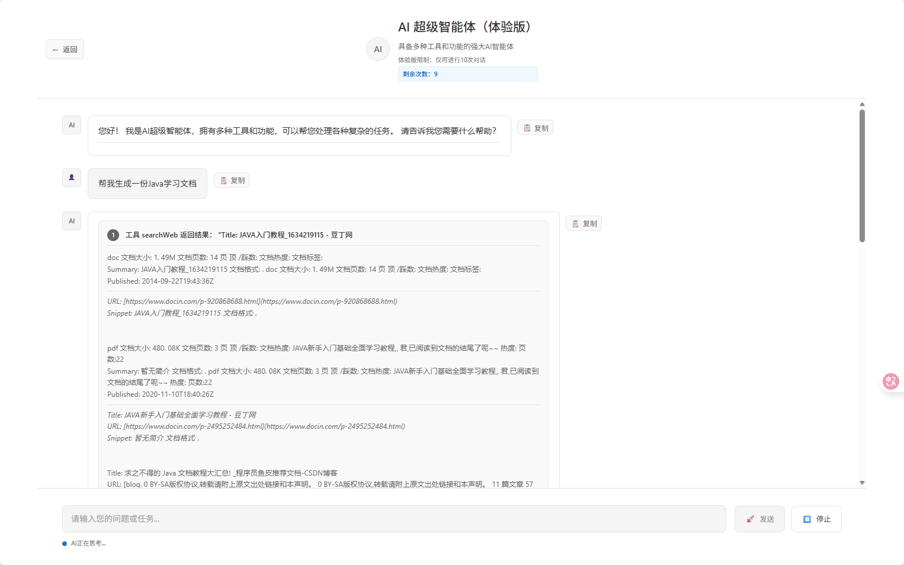
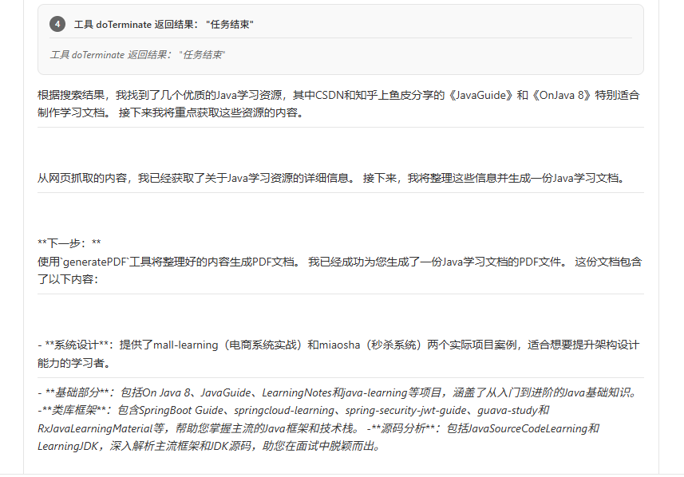
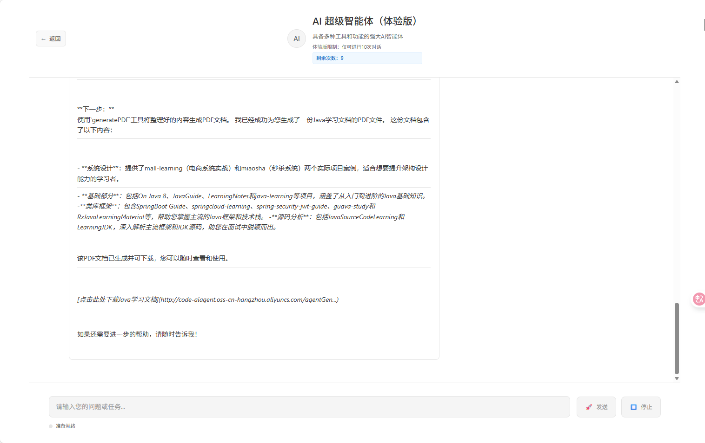

# code-helper-aiagent
https://github.com/ytqwerasdf/code-helper-aiagent
## Agent效果图



## AI Agent 项目说明

一个基于 Spring Boot 3 的 AI Agent 后端（Java 21 + Maven）与前端（Vite + Vue）工程，集成阿里云灵积 DashScope、Spring AI、LangChain4j、PgVector 等能力，并支持 GitHub Actions 一键部署到服务器（前后端分别部署）。

### 功能概述
- 后端 API：对话、工具调用、文档处理、MCP 客户端等
- 前端站点：静态构建产物 `dist/`，由 Nginx 托管
- 自动化部署：通过 GitHub Actions 分前后端流水线自动构建与部署
- 容器化：提供 Dockerfile 与 docker-compose 编排

---

## 目录结构

```
ai-agent/
├─ src/main/java/com/yt/aiagent/...     # 后端源代码（Spring Boot 3）
├─ src/main/resources/                  # Spring 配置、MCP 配置、文档
│  ├─ application.yml                   # 基本配置（建议仅做缺省项）
│  ├─ application-local.yml             # 本地环境
│  ├─ application-prd.yml               # 生产环境（通过环境变量注入敏感信息）
│  ├─ mcp-servers.json                  # MCP 服务器配置（支持构建期或运行期注入变量）
│  └─ document/                         # 示例文档
├─ ai-agent-frontend/                   # 前端工程（Vite + Vue）
│  └─ src/
├─ docker/
│  ├─ Dockerfile                        # 后端镜像构建
│  └─ docker-compose.yml                # 生产编排（Nginx/前端静态资源目录需自备）
├─ .github/workflows/
│  ├─ deploy-backend.yml                # 后端自动部署（mvn 构建 + 传输 jar + 重启）
│  └─ deploy-frontend.yml               # 前端自动部署（npm 构建 + 传输 dist + reload Nginx）
├─ pom.xml                              # Maven 配置
└─ README.md
```

---

## 技术栈与依赖

- 后端：Spring Boot 3、Spring AI、LangChain4j、PgVector、Knife4j、Hutool、Jsoup、iTextPDF
- 前端：Vite + Vue 3
- 构建与部署：Maven、GitHub Actions、Docker / docker-compose、Nginx（前端静态托管）


---

## 本地开发与运行

### 后端（Java 21 + Maven）
1. 安装 JDK 21 与 Maven 3.9+
2. 本地运行（使用 `local` 配置）：
   ```bash
   mvn spring-boot:run -Dspring-boot.run.profiles=local
   ```
3. 打包：
   ```bash
   mvn -DskipTests clean package
   ```

### 前端（Node 18+）
```bash
cd ai-agent-frontend
npm ci
npm run dev       # 本地开发
npm run build     # 生成 dist
```

---

## 容器化部署

### 使用 docker-compose（后端）
编辑 `docker/docker-compose.yml`：

```yaml
services:
  ai-agent-backend:
    build:
      context: .
      dockerfile: Dockerfile
    container_name: ai-agent-backend
    ports:
      - "8123:8123"
    environment:
      - SPRING_PROFILES_ACTIVE=prd
      - SPRING_DATASOURCE_URL=${SPRING_DATASOURCE_URL}
      - SPRING_DATASOURCE_USERNAME=${SPRING_DATASOURCE_USERNAME}
      - SPRING_DATASOURCE_PASSWORD=${SPRING_DATASOURCE_PASSWORD}
      - SPRING_AI_DASHSCOPE_API_KEY=${SPRING_AI_DASHSCOPE_API_KEY}
      - SEARCH_API_KEY=${SEARCH_API_KEY}
      - LANGSEARCH_API_KEY=${LANGSEARCH_API_KEY}
      - PEXELS_API_KEY=${PEXELS_API_KEY}
    volumes:
      - ./logs:/app/logs
    restart: unless-stopped
```

准备 `.env`（与 compose 同目录）：

```
SPRING_DATASOURCE_URL=jdbc:postgresql://host:5432/aiagent
SPRING_DATASOURCE_USERNAME=postgres
SPRING_DATASOURCE_PASSWORD=******
SPRING_AI_DASHSCOPE_API_KEY=sk-******
SEARCH_API_KEY=******
LANGSEARCH_API_KEY=******
PEXELS_API_KEY=******
```

启动：
```bash
cd docker
docker compose up -d --build
```

### 前端静态站点

前端构建产物为 `dist/`，建议放置到服务器目录 `/opt/ai-agent-frontend/dist`，由 Nginx 托管：

```nginx
server {
    listen 80;
    server_name your-domain.com;

    root /opt/ai-agent-frontend/dist;
    index index.html;

    location / {
        try_files $uri $uri/ /index.html;
    }

    location /api {
        proxy_pass http://127.0.0.1:8123;
        proxy_set_header Host $host;
        proxy_set_header X-Real-IP $remote_addr;
        proxy_set_header X-Forwarded-For $proxy_add_x_forwarded_for;
        proxy_set_header X-Forwarded-Proto $scheme;
    }
}
```

---

## GitHub Actions 自动部署

本仓库已提供前后端独立的部署流水线：

- `.github/workflows/deploy-backend.yml`
  - 触发：`main` 分支且后端文件变更
  - 步骤：Checkout → Maven 打包 → 传输 jar 至服务器 `/tmp/target/...` → 停止旧服务 → 覆盖 `/opt/ai-agent/agent-backend/ai-agent-0.0.1-SNAPSHOT.jar` → 启动 → 健康检查（`/api/ai/health`）

- `.github/workflows/deploy-frontend.yml`
  - 触发：`main` 分支且 `ai-agent-frontend/**` 变更
  - 步骤：Checkout → Node 构建 → 打包 `dist.tar.gz` → 上传至 `/tmp` → 解压至 `/opt/ai-agent-frontend` → `systemctl reload nginx`

需要在仓库 `Settings → Secrets and variables → Actions` 配置：

```
REMOTE_HOST, REMOTE_USER, DEPLOY_SSH_KEY
OSS_ACCESS_KEY_ID, OSS_ACCESS_KEY_SECRET
SPRING_DATASOURCE_URL, SPRING_DATASOURCE_USERNAME, SPRING_DATASOURCE_PASSWORD
SPRING_AI_DASHSCOPE_API_KEY, SEARCH_API_KEY, LANGSEARCH_API_KEY, PEXELS_API_KEY
```

---

## MCP 配置与 Amap Key 注入

`src/main/resources/mcp-servers.json` 里的普通 JSON 不会自动解析 Spring 占位符，推荐两种方式注入高德 Key：

1) 构建期（Maven 资源过滤，推荐在 CI 注入）

在 `pom.xml` 限定仅过滤该文件：

```xml
<build>
  <resources>
    <resource>
      <directory>src/main/resources</directory>
      <filtering>false</filtering>
      <excludes>
        <exclude>mcp-servers.json</exclude>
      </excludes>
    </resource>
    <resource>
      <directory>src/main/resources</directory>
      <filtering>true</filtering>
      <includes>
        <include>mcp-servers.json</include>
      </includes>
    </resource>
  </resources>
  <!-- 构建时通过环境变量 env.AMAP_MAPS_API_KEY 替换占位符 -->
</build>
```

在 `mcp-servers.json` 使用占位：

```json
{ "AMAP_MAPS_API_KEY": "${env.AMAP_MAPS_API_KEY}" }
```

2) 运行期（模板渲染）

将文件改为 `mcp-servers.json.tpl`，内容写 `${AMAP_MAPS_API_KEY}`，启动脚本中：

```bash
envsubst < /opt/ai-agent/mcp-servers.json.tpl > /opt/ai-agent/mcp-servers.json
```

---

## 常见问题（FAQ）

1) 401 未授权（DashScope）
   - 检查是否使用了 `SPRING_AI_DASHSCOPE_API_KEY`（而不是带点号的变量名）
   - 确认未使用引号包裹值
   - 激活 `SPRING_PROFILES_ACTIVE=prd`

2) 前端部署后出现多一层目录
   - 构建打包：`tar -czf dist.tar.gz dist`（包含 dist 目录本身）
   - 服务器解压到 `/opt/ai-agent-frontend/`，最终路径应为 `/opt/ai-agent-frontend/dist/...`
   - CI 上传时只上传根目录 `dist.tar.gz`，避免 scp 保留父目录层级

3) GitHub Actions 上传到 `/tmp/target/`
   - 某些 SCP Action 会保留源路径层级，建议：
     - 明确目标只为目录 `/tmp/`，脚本中从 `/tmp/target/...` 移动到目标位置；或
     - 使用原生 `scp` 并指定完整目标文件名

---
## TODO

因为本项目是作为服务端运行，导致其终端命令和文件修改等工具作用范围有限，
有兴趣的同学可以基于此项目改造成客户端，也许能实现类似Cursor自动修改代码，自动编译运行的能力

---
## License

本项目仅供学习交流使用，企业或生产使用请自行评估与加固安全策略（密钥管理、鉴权、限流、日志脱敏等）。


